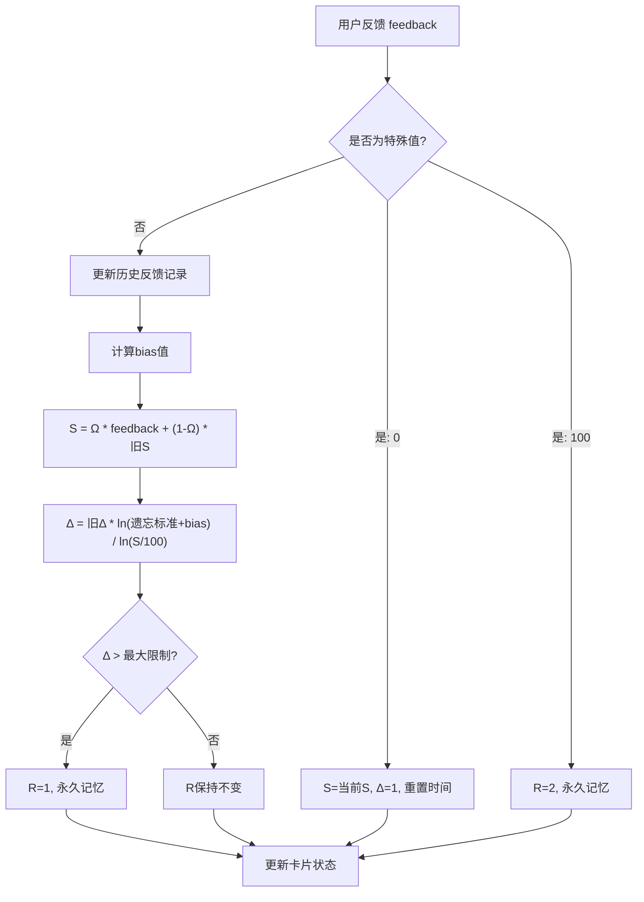
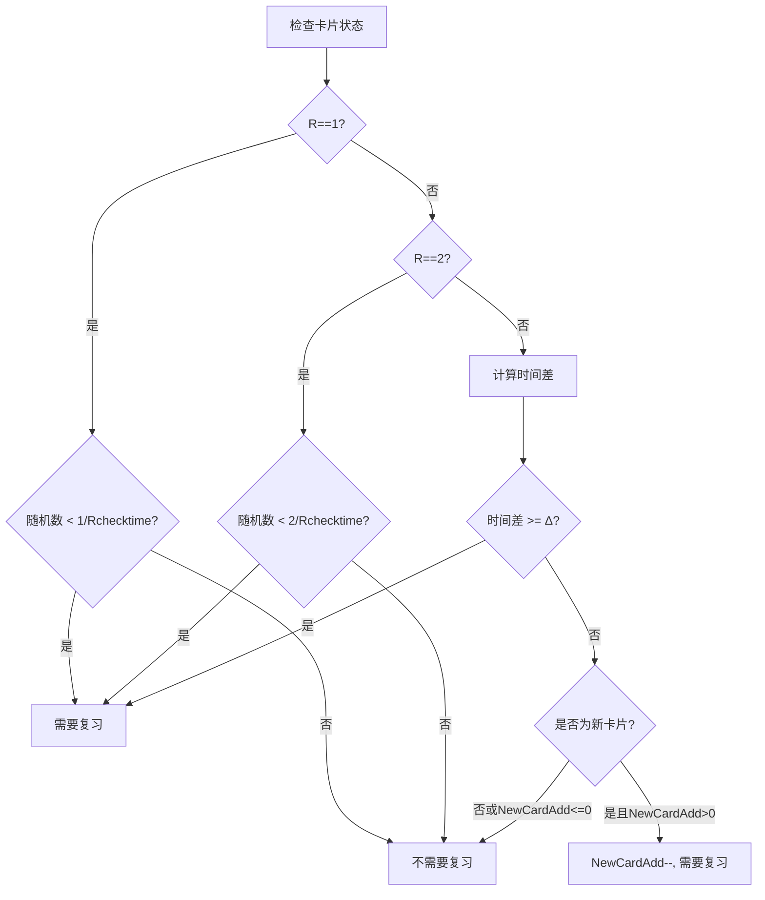
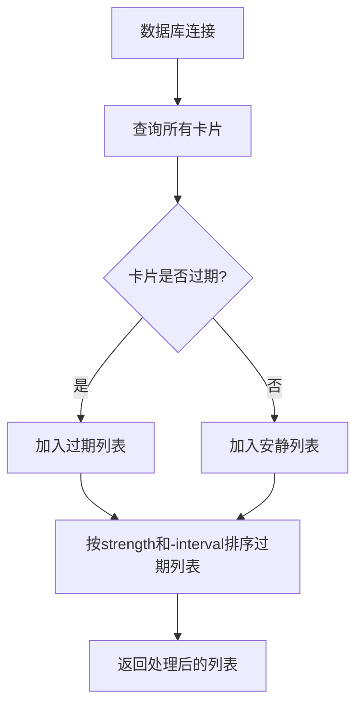
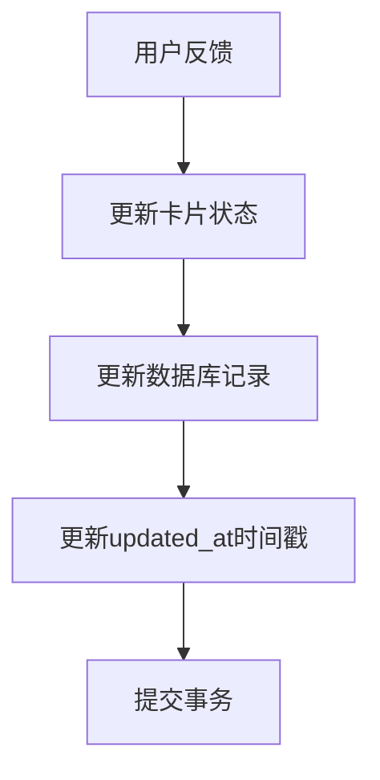

# Linear_Memo 核心算法与数据结构

## 概述

Linear_Memo 是一个基于记忆半衰期理论的记忆辅助工具，通过线性反馈算法动态调整复习间隔，帮助用户高效记忆。

## 核心概念

### 记忆强度 (S)
表示用户对某个记忆卡片的掌握程度，取值范围为 0-1，值越高表示掌握得越好。

### 复习间隔 (Δ)
表示下次需要复习该卡片的时间间隔，以天为单位。

### 记忆状态 (R)
- 0: 正常状态
- 1: 永久记忆状态
- 2: 需要加强状态

## 数据结构

### `card` 类

`card` 类是 Linear_Memo 的核心数据结构，用于表示一个记忆卡片。

#### 数据库表结构

在新的技术路线中，卡片信息将存储在 SQLite 数据库中，表结构如下：

```sql
CREATE TABLE cards (
    id INTEGER PRIMARY KEY AUTOINCREMENT,
    front TEXT NOT NULL,           -- 卡片正面内容
    back TEXT NOT NULL,            -- 卡片背面内容
    last_review DATETIME,          -- 上次复习时间
    history TEXT,                  -- 历史反馈记录
    strength REAL,                 -- 当前记忆强度 (0-1)
    interval REAL,                 -- 下次复习间隔 (天)
    status INTEGER,                -- 记忆状态 (0=正常, 1=永久记忆, 2=需要加强)
    created_at DATETIME DEFAULT CURRENT_TIMESTAMP,
    updated_at DATETIME DEFAULT CURRENT_TIMESTAMP
);
```

#### 属性映射关系

数据库字段与原 `basedata` 列表的对应关系：

- `front` (TEXT): 卡片正面内容 ← `basedata[0]` (F)
- `back` (TEXT): 卡片背面内容 ← `basedata[1]` (B)
- `last_review` (DATETIME): 上次复习时间 ← `basedata[2]` (T)
- `history` (TEXT): 历史反馈记录 ← `basedata[3]` (H)
- `strength` (REAL): 当前记忆强度 (0-1) ← `basedata[4]` (S)
- `interval` (REAL): 下次复习间隔 (天) ← `basedata[5]` (Δ)
- `status` (INTEGER): 记忆状态 (0=正常, 1=永久记忆, 2=需要加强) ← `basedata[6]` (R)

#### 主要方法

- `is_overtime()`: 判断卡片是否过期需要复习
- `review(feedback)`: 根据用户反馈更新卡片状态
- `front()` / `back()`: 获取卡片正面/背面内容

## 核心算法

### 线性反馈算法

Linear_Memo 的核心是线性反馈算法，用于根据用户反馈动态调整复习间隔。



算法参数:
- Ω (经验权重): 0.95
- ForgetLine (遗忘标准): 0.4
- MaxCalcLimit (R=1判断条件): 300

### 最小二乘法 (OLS)

用于分析用户历史反馈趋势，计算 bias 值。

```python
def OLS(x, y) -> float:
    k = (sum(listcalc(x, "*", y)) - sum(x) * sum(y) / len(x)) / (sum(listcalc(x, "*", x)) - (sum(x) ** 2) / len(x))
    b = sum(y) / len(y) - k * sum(x) / len(x)
    Rs = 1 - sum(listcalc(listcalc(y, "-", listcalc(listcalc(x, "*", k), "+", b)), "**", 2)) / sum(listcalc(listcalc(y, "-", (sum(y) / len(y))), "**", 2))
    Ss = sum(listcalc(listcalc(y, "-", listcalc(listcalc(x, "*", k), "+", b)), "**", 2)) / sum(listcalc(listcalc(y, "-", (sum(y) / len(y))), "**", 2))
    return k, b, Rs, Ss

# 计算数列的辅助函数
def listcalc(l1, calc, l2) -> list:
    out = []
    if isinstance(l2, list):
        match calc:
            case "+":
                for num in range(len(l1)):
                    out.append(l1[num] + l2[num])
            case "-":
                for num in range(len(l1)):
                    out.append(l1[num] - l2[num])
            case "*":
                for num in range(len(l1)):
                    out.append(l1[num] * l2[num])
            case "/":
                for num in range(len(l1)):
                    out.append(l1[num] / l2[num])
    else:
        match calc:
            case "+":
                for num in range(len(l1)):
                    out.append(l1[num] + l2)
            case "-":
                for num in range(len(l1)):
                    out.append(l1[num] - l2)
            case "*":
                for num in range(len(l1)):
                    out.append(l1[num] * l2)
            case "/":
                for num in range(len(l1)):
                    out.append(l1[num] / l2)
            case "**":
                for num in range(len(l1)):
                    out.append(l1[num] ** l2)
    return out
```

函数返回值说明：
- `k`: 线性回归的斜率
- `b`: 线性回归的截距
- `Rs`: 拟合优度（R-squared）
- `Ss`: 标准化残差平方和（用于计算 bias 值）

函数返回值说明：
- `k`: 线性回归的斜率
- `b`: 线性回归的截距
- `Rs`: 拟合优度（R-squared）
- `Ss`: 标准化残差平方和（用于计算 bias 值）

### 卡片过期判断



判断逻辑说明：
1. 如果 R==1（永久记忆状态），则以 1/Rchecktime 的概率随机抽查复习
2. 如果 R==2（需要加强状态），则以 2/Rchecktime 的概率随机抽查复习
3. 否则，如果距离上次复习的时间大于等于 Δ 天，则需要复习
4. 对于新卡片（只有一个历史反馈记录且 S=0.4），如果 NewCardAdd 计数器大于 0，则需要复习

### 数据库操作



### 数据库更新操作



## 关键参数说明

| 参数 | 默认值 | 说明 |
|------|--------|------|
| Ω (Omega) | 0.95 | 经验权重，用于计算新的记忆强度 |
| ForgetLine | 0.4 | 遗忘标准，当记忆强度低于此值时认为已遗忘 |
| MaxCalcLimit | 300 | R=1 的判断条件，当 Δ 大于此值时认为进入永久记忆状态 |
| Rchecktime | 0 | R==1 时的抽查底数，越大越不易出现，等于 0 关闭抽查复习 |
| NewCardAdd | 10000 | 每次计算推荐多少全新的卡片 |

## 工作流程

1. **初始化**：从数据库加载所有卡片
2. **分类**：将卡片分为过期列表和安静列表
3. **排序**：按记忆强度和复习间隔对过期列表进行排序
4. **复习**：从过期列表中选择卡片进行复习
5. **反馈**：用户给出反馈（0-100）
6. **更新**：根据反馈更新卡片状态和下次复习时间
7. **保存**：将更新后的卡片信息保存到数据库

## 核心函数实现

### is_overtime() - 判断卡片是否过期

```python
def is_overtime(card):
    # 随机复习
    if card.status == 1:
        if randint(0, Rchecktime) == 1:
            return True
        else:
            return False
    elif card.status == 2:
        if randint(0, int(Rchecktime / 2)) == 1:
            return True
        else:
            return False
    # 超时判断
    period = datetime.now() - card.last_review
    if period.days < card.interval:
        # 不超时就没过期，不用复习
        return False
    # 新卡片计数加入
    if len(card.history.split(",")) == 1 and card.strength == 0.4:
        global NewCardAdd
        if NewCardAdd > 0:
            NewCardAdd -= 1
            return True
        else:
            return False
    # 其它情况全部复习
    return True
```

### review(feedback) - 根据用户反馈更新卡片状态

```python
from math import log
from datetime import datetime

def review(card, feedback):
    """feedback∈[0,100]"""
    if abs(feedback - 100) <= 0.00000000000001:
        card.status = 2
        return (100, card.interval)
    if abs(feedback - 0) <= 0.00000000000001:
        card.last_review = datetime.now()
        card.interval = 1
        return (card.strength * 100, card.interval)
    
    card.history += ",{:.2f}".format(feedback / 100)
    
    # 线性回归求bias
    y = [float(i) for i in card.history.split(",")]
    if len(y) <= 20:  # 新卡片保护
        bias = 0
    else:
        x = [i / len(y) for i in range(1, len(y) + 1)]
        _, _, _, Ss = OLS(x, y)
        bias = (Ss - 0.5) * 0.1
    
    # 核心三句
    S = Ω * feedback + (1 - Ω) * card.strength * 100
    Δ = card.interval * log(ForgetLine + bias) / log(S / 100)
    T = datetime.now()
    
    if Δ > MaxCalcLimit:
        R = 1
    else:
        R = card.status
    
    # 判断永久记忆是否退化
    if R == 1 and Δ < MaxCalcLimit * 0.8:
        R = 0
        S = 40
        Δ = 1
        card.strength = S / 100
        card.interval = Δ
        card.last_review = T
        card.status = R
    
    if R == 2 and feedback <= 40:
        R = 0
        S = 40
        Δ = 1
        card.strength = S / 100
        card.interval = Δ
        card.last_review = T
        card.status = R
    
    if Δ <= 0:
        Δ = -Δ + 0.01
    
    if Δ > 1:
        card.strength = S / 100
        card.interval = Δ
        card.last_review = T
        card.status = R
        return (S, Δ)
    else:
        card.strength = S / 100
        card.interval = Δ
        card.status = R
        return (S, Δ)
```